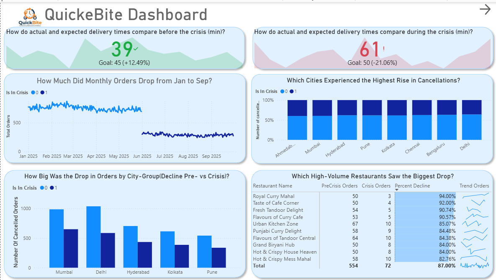
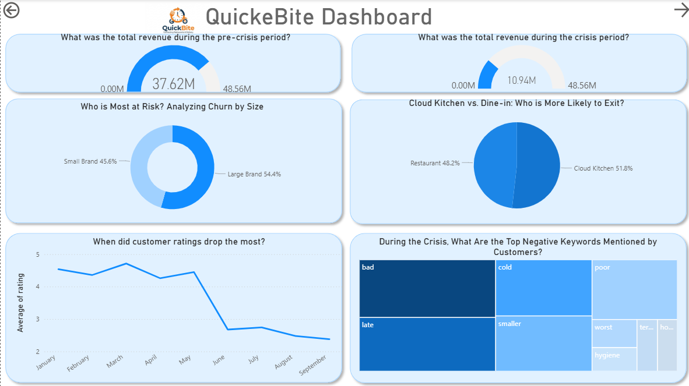
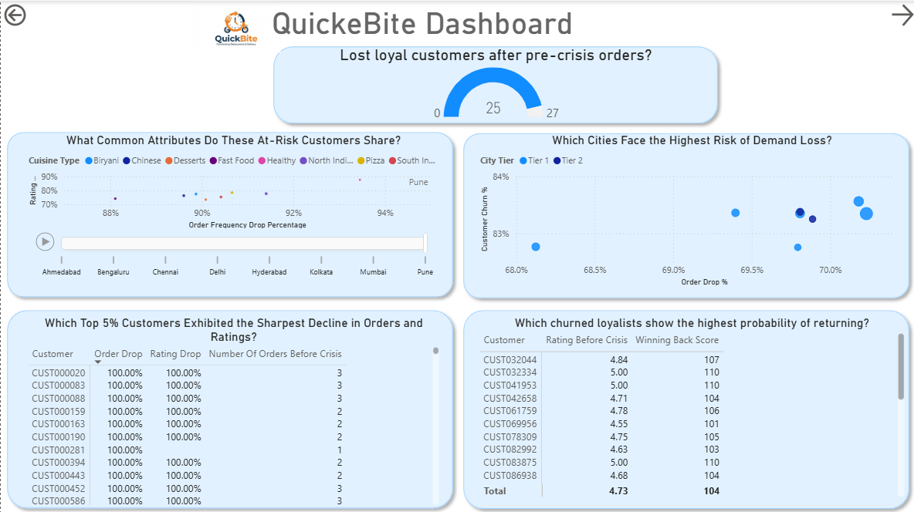

# Power BI Crisis Insights

This repository contains a Power BI project aimed at analyzing customer behavior, order trends, and sentiment during a crisis period. The project helps identify demand loss, revenue decline, and shifts in customer preferences across cities, restaurants, and order types.

## Project Objectives

- **Analyze order decline:** Compare pre-crisis and crisis period orders to identify patterns and severity of decline.  
- **Identify demand loss:** Determine Tier-1 and Tier-2 cities at risk of long-term demand loss.  
- **Customer behavior analysis:** Track high-value vs. low-value orders and identify lost loyal customers.  
- **Sentiment insights:** Extract and visualize frequently occurring negative keywords from customer reviews.  
- **High-volume impact:** Identify top restaurants/cities affected during the crisis.  

## Key Features

- **Dynamic charts and visuals:** Bar charts, matrices, and trend visuals to track key metrics.  
- **Revenue & demand loss calculations:** Measures for lost customers, high-value order decline, and percentage drop in orders.  
- **Crisis vs. pre-crisis comparisons:** Filters and measures to segment data based on the crisis timeline.  
- **Interactive dashboard:** Easy-to-use visuals for insights across multiple dimensions (customer, city, restaurant).  

## Measures & Calculations

- **Lost Customers:** Identify customers who stopped ordering during the crisis.  
- **High-Rated Lost Customers:** Focus on lost customers with average ratings above 4.5.  
- **Order Decline Severity:** Measure percentage decline for restaurants and cities.  
- **Revenue Estimation:** revenue in crisis vs pre-crisis.  

## How to Use

1. Open the `.pbix` file in Power BI Desktop.  
2. Load the dataset from the `dataset/` folder.  
3. Use the dashboard filters to analyze pre-crisis vs. crisis periods.  
4. Explore the interactive visuals to identify insights across customers, cities, and restaurants.

## Authors

- Rachid Jedata – Project Owner & Data Analyst  

## License

This project is licensed under the MIT License.  
